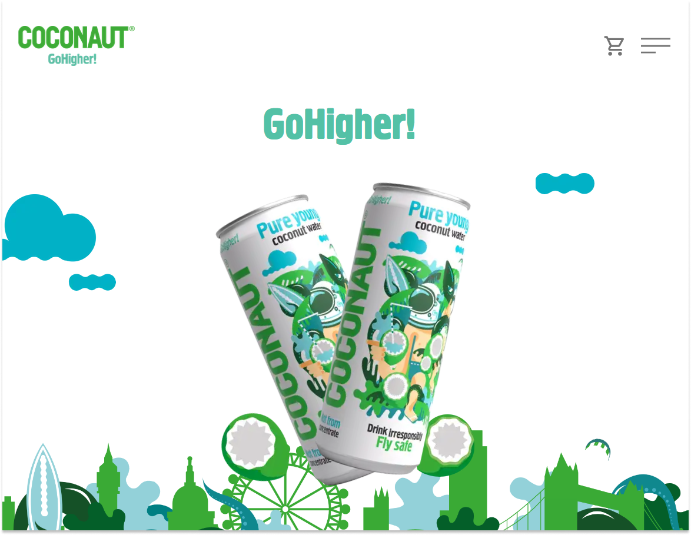

<p align="center">
  <a href="https://www.gatsbyjs.com/?utm_source=starter&utm_medium=readme&utm_campaign=minimal-starter">
    
  </a>
</p>
<h1 align="center">
  CoconautUK - Go Higher!
</h1>



## 🚀 Quick start

1.  **Start developing.**

    Navigate into your new site’s directory and start it up.

    ```shell
    cd coconaut_uk
    npm run develop
    ```

1.  **Open the code and start customizing!**
    Your site is now running at http://localhost:8000!

## 🔨 Built using
- [ReactJS](https://reactjs.org/)
- [TypeScript](https://www.typescriptlang.org/)
- [GatsbyJS](https://www.gatsbyjs.com/)
- [StyledComponents](https://styled-components.com/)
- [Framer Motion](https://www.framer.com/motion/)
- [Contentful](https://www.contentful.com/)
- [Shopify](https://www.shopify.com/)

## 🗄️ Hosting 
This website is currently hosted on [Netlify]() under 
[coconaut.co.uk](coconaut.co.uk)

[](https://app.netlify.com/sites/coconautuk/deploys)
